```mermaid

graph TD
    subgraph "Configuration Dependencies"
        A[application.yml]
        B[MySQL Database<br/>cloud_sample]
        C[Redis Cache<br/>Database 0]
        D[MQTT Broker<br/>Mosquitto/EMQX]
        E[Cloud Storage<br/>OSS/S3/MinIO]
    end    
    subgraph "Maven Dependencies"
        F[Spring Boot 2.7.12<br/>Web Framework]
        G[MySQL Connector 8.0.31<br/>Database Driver]
        H[MyBatis Plus 3.4.2<br/>ORM Framework]
        I[Druid 1.2.6<br/>Connection Pool]
        J[Redis Lettuce<br/>Redis Client]
        K[Spring MQTT 5.5.5<br/>Device Communication]
        L[JWT 3.12.1<br/>Authentication]
        M[Aliyun OSS 3.12.0<br/>Cloud Storage]
        N[AWS S3 SDK 1.12.261<br/>Cloud Storage]
        O[MinIO 8.3.7<br/>Self-hosted Storage]
        P[OkHttp3 4.9.1<br/>HTTP Client]
        Q[Jackson JSR310<br/>JSON Processing]
        R[Lombok<br/>Code Generation]
        S[BouncyCastle 1.69<br/>Cryptography]
        T[DOM4J 2.1.3<br/>XML Processing]
    end
    
    subgraph "DJI Cloud SDK 1.0.3"
        U[Device Management API]
        V[Wayline Management API]
        W[Media Management API]
        X[Live Stream API]
        Y[Map/Flight Area API]
        Z[Property Control API]
        AA[Firmware Update API]
        BB[HMS Health API]
        CC[Log Management API]
    end
    
    subgraph "Data Flow"
        DD[Device Status<br/>MQTT Topic: sys/product/+/status]
        EE[Device Commands<br/>MQTT Topic: thing/product/+/requests]
        FF[Media Files<br/>Upload to Cloud Storage]
        GG[Wayline Files<br/>Flight Plans]
        HH[Live Stream Data<br/>RTMP/WebRTC/Agora]
        II[Device Logs<br/>Diagnostic Data]
        JJ[HMS Messages<br/>Health Monitoring]
    end
    
    subgraph "API Endpoints"
        KK["/api/v1/manage/*"<br/>Device Management]
        LL["/api/v1/wayline/*"<br/>Flight Planning]
        MM["/api/v1/media/*"<br/>File Management]
        NN["/api/v1/map/*"<br/>Map Operations]
        OO["/api/v1/storage/*"<br/>Cloud Storage]
        PP["/api/v1/control/*"<br/>Device Control]
        QQ["/api/v1/ws"<br/>WebSocket]
    end
    
    %% Configuration connections
    A --> B
    A --> C
    A --> D
    A --> E
    
    %% Framework dependencies
    F --> G
    F --> H
    F --> I
    F --> J
    F --> K
    F --> L
    F --> M
    F --> N
    F --> O
    F --> P
    F --> Q
    F --> R
    F --> S
    F --> T
    
    %% SDK connections
    U --> B
    V --> B
    W --> E
    X --> HH
    Y --> B
    Z --> DD
    AA --> B
    BB --> II
    CC --> B
    
    %% Data flow connections
    DD --> K
    EE --> K
    FF --> E
    GG --> E
    HH --> P
    II --> E
    JJ --> B
    
    %% API endpoint connections
    KK --> U
    LL --> V
    MM --> W
    NN --> Y
    OO --> E
    PP --> Z
    QQ --> F
    
    %% Styling
    classDef configStyle fill:#000
    classDef depStyle fill:#000
    classDef sdkStyle fill:#000
    classDef dataStyle fill:#000
    classDef apiStyle fill:#000
    
    class A,B,C,D,E configStyle
    class F,G,H,I,J,K,L,M,N,O,P,Q,R,S,T depStyle
    class U,V,W,X,Y,Z,AA,BB,CC sdkStyle
    class DD,EE,FF,GG,HH,II,JJ dataStyle
    class KK,LL,MM,NN,OO,PP,QQ apiStyle
```

# 关于DJI Cloud API Demo 终止维护公告

发布日期：2025年4月10日

1.项目终止维护说明
即日起，大疆创新(DJI)将停止对DJI Cloud API Demo (地址：https://github.com/dji-sdk/Cloud-API-Demo-Web、https://github.com/dji-sdk/DJI-Cloud-API-Demo）示例项目的更新与技术支持。
该项目作为官方提供的云端集成参考实现，旨在辅助开发者理解API调用逻辑。并非生产级解决方案，可能存在未修复的安全隐患（如数据泄露、未授权访问等）。请避免在生产环境中直接使用Demo中的代码，若直接使用我们强烈建议您启动安全自查，或避免将基于该Demo的服务暴露于公网环境。

2.免责声明
因直接使用Demo代码导致的业务损失、数据风险或第三方纠纷，DJI将不承担任何责任。

3.后续支持
如有疑问，请联系DJI开发者支持团队（邮箱：developer@dji.com)或访问大疆开发者社区获取最新技术资源。
感谢您一直以来的理解与支持！

# DJI Cloud API

## What is the DJI Cloud API?

The launch of the Cloud API mainly solves the problem of developers reinventing the wheel. For developers who do not need in-depth customization of APP, they can directly use DJI Pilot2 to communicate with the third cloud platform, and developers can focus on the development and implementation of cloud service interfaces. 

## Docker

If you don't want to install the development environment, you can try deploying with docker. [Click the link to download.](https://terra-sz-hc1pro-cloudapi.oss-cn-shenzhen.aliyuncs.com/c0af9fe0d7eb4f35a8fe5b695e4d0b96/docker/cloud_api_sample_docker.zip)

## Usage

For more documentation, please visit the [DJI Developer Documentation](https://developer.dji.com/doc/cloud-api-tutorial/cn/).

## Latest Release

Cloud API 1.10.0 was released on 7 Apr 2024. For more information, please visit the [Release Note](https://developer.dji.com/doc/cloud-api-tutorial/cn/).

## License

Cloud API is MIT-licensed. Please refer to the LICENSE file for more information.

## Diagrams:

```mermaid
graph TB
    subgraph "Client Applications"
        A[DJI Pilot 2] 
        B[Web Dashboard]
        C[Mobile Apps]
    end
    
    subgraph "DJI Cloud API Demo Application"
        D[Spring Boot Application<br/>Port: 6789]
        
        subgraph "Controllers Layer"
            E[Device Controller]
            F[Wayline Controller] 
            G[Media Controller]
            H[Map Controller]
            I[Storage Controller]
        end
        
        subgraph "Service Layer"
            J[Device Service]
            K[Wayline Service]
            L[Media Service]
            M[Map Service]
            N[Storage Service]
        end
        
        subgraph "Components"
            O[JWT Authentication]
            P[MQTT Client]
            Q[WebSocket Handler]
            R[File Upload Handler]
        end
    end
    
    subgraph "External Services"
        S[MQTT Broker<br/>Port: 1883/8083]
        T[MySQL Database<br/>Port: 3306]
        U[Redis Cache<br/>Port: 6379]
        
        subgraph "Cloud Storage"
            V[Aliyun OSS]
            W[AWS S3]
            X[MinIO]
        end
        
        subgraph "Live Streaming"
            Y[Agora RTC]
            Z[RTMP Server]
            AA[RTSP Server]
            BB[GB28181 Server]
            CC[WebRTC/WHIP]
        end
    end
    
    subgraph "DJI Devices"
        DD[DJI Dock]
        EE[DJI Drones]
        FF[Remote Controllers]
        GG[Payloads/Cameras]
    end
    
    subgraph "Dependencies Flow"
        HH[Spring Boot Framework]
        II[MyBatis Plus ORM]
        JJ[Druid Connection Pool]
        KK[Jackson JSON]
        LL[Lombok Annotations]
    end
    
    %% Client connections
    A -->|HTTP/WebSocket| D
    B -->|HTTP/WebSocket| D
    C -->|HTTP/WebSocket| D
    
    %% Internal application flow
    D --> E
    D --> F
    D --> G
    D --> H
    D --> I
    
    E --> J
    F --> K
    G --> L
    H --> M
    I --> N
    
    J --> O
    K --> P
    L --> Q
    M --> R
    
    %% External service connections
    D -.->|TCP/WebSocket| S
    D -.->|JDBC| T
    D -.->|Redis Protocol| U
    
    N -.->|HTTPS| V
    N -.->|HTTPS| W
    N -.->|HTTP| X
    
    D -.->|RTC| Y
    D -.->|RTMP| Z
    D -.->|RTSP| AA
    D -.->|UDP/TCP| BB
    D -.->|HTTP/WebRTC| CC
    
    %% Device connections
    DD -->|MQTT| S
    EE -->|MQTT| S
    FF -->|MQTT| S
    GG -->|MQTT| S
    
    %% Dependencies
    HH -.-> D
    II -.-> T
    JJ -.-> T
    KK -.-> D
    LL -.-> D
    
    %% Styling
    classDef clientStyle fill:#000000
    classDef appStyle fill:#000000
    classDef serviceStyle fill:#000000
    classDef deviceStyle fill:#000000
    classDef depStyle fill:#000000
    
    class A,B,C clientStyle
    class D,E,F,G,H,I,J,K,L,M,N,O,P,Q,R appStyle
    class S,T,U,V,W,X,Y,Z,AA,BB,CC serviceStyle
    class DD,EE,FF,GG deviceStyle
    class HH,II,JJ,KK,LL depStyle
```

 

 
 
 

